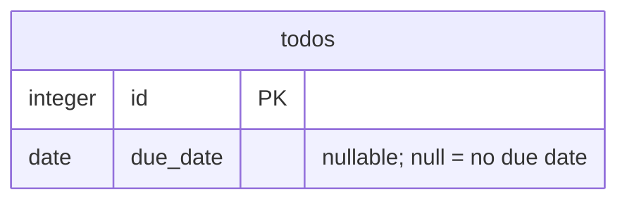

# Data model (system layer · view 4 of 4)

You model the data of **one bounded context**. This layer is global and single-source-of-truth; you read
the whole relevant data model and add to it. Cadence is coarser than a spec on purpose — the data model is
owned across specs, so two specs that touch the same concept must not model it twice. You run after the
domain view (in parallel with architecture).

## What you write

| File (under `_system/<ctx>/`) | Element id | Holds |
| --- | --- | --- |
| `data-model.md` | `DATA-<CTX>-NNN` | logical model (DBML SSOT) → schema, ownership, keys, migration, derived ER diagram |

**Data follows the domain.** Read `domain-model.md` first; your tables/columns realise the domain entities
(`DOM-<CTX>-NNN`), they do not invent new concepts. If you find yourself naming a new concept, that belongs
in the **domain perspective** ([references/domain.md](domain.md)).

## Structured SSOT + derived skin (the key discipline)

There is **one structured SSOT, and it matches the actual persistence** — the diagram and any DDL are
*derived* from it (DOC_TAXONOMY §データビューの実体化). Author the structured source, regenerate the
diagram — never hand-edit the diagram to diverge. **Pick the SSOT by what the system actually persists:**

| Persistence the system targets | Structured SSOT you author | Derived skin |
| --- | --- | --- |
| a relational DB (Postgres/MySQL/SQLite) | **DBML** — table/column/type/PK·FK/enum/index; `@dbml/cli` → SQL | Mermaid `erDiagram` |
| a JSON / document store, or an in-process store validated by **code types** (Zod/TS, pydantic, JSON Schema) | the **live code schema itself** — *reference* it (e.g. `src/domain/schema.ts`), don't transcribe it | Mermaid `erDiagram` / type graph |
| an event log / message bus | the **event/message schema** (Avro/Protobuf/JSON Schema) | sequence / flow diagram |

The unbreakable rule is **single source**: if the system is already validated by a code schema, that schema
**is** the SSOT — re-modelling it as DBML creates a second source that drifts (exactly what this view
exists to prevent). Author DBML only when the database *is* the source of truth (no code schema upstream).

Tag each `DATA-<CTX>-NNN` element where it lives — a DBML comment/`note:`, or (schema-referenced) a one-line
entry naming the type and file — so the id stays referenceable (`dependsOnSystem` and `check-*` find it by
text). Judgement (invariants, the reason for a migration) stays prose; the structure and diagram are
structured/derived.

**Skip the data view when the change persists nothing new** — a feature that only mutates existing records
(a status transition, a flag) adds no `DATA-<CTX>-NNN` element. Don't manufacture a data model to fill a
slot; run the view only when there is genuinely new persisted state.

## Lazy boundary / coherent within

- **Coherent** — model the touched aggregate's data coherently (ownership, keys, relations) so a later
  spec cannot add the same entity under a different table/name.
- **Lazy** — materialise only the physical columns the current acceptance criteria need. Defer the rest;
  add them additively when an AC requires them.
- **Falsifiable test** for a column/table: *"If I omit this, can a future spec re-introduce the same data
  under a different name?"* Yes → model now. No → defer.

## Additive only / migration

- `DATA-<CTX>-NNN` ids are unique and stable within the context. Never renumber or rewrite an existing
  id's meaning.
- A change is a **new** element + a migration, with a back-compat note (e.g., existing rows read as null).

## Worked example A — relational DB (Todo-due, "scheduling" context, first touch)

When the system targets a relational DB, **DBML is the SSOT**:

```dbml
// DATA-scheduling-014 — todos.dueDate: persisted due-date value; realises DOM-scheduling-001. owner: todo module.
Table todos {
  id integer [pk]
  due_date date [null, note: 'DATA-scheduling-014 — ISO-8601; null = no due date (first-class), never a sentinel']
}
```

Derived ER view (regenerated from the DBML, not hand-authored):



Only the one column the AC needs is materialised; overdue stays derived (no column); the rest of any
scheduling schema is deferred (lazy). Migration is additive — existing rows read as `null`, no backfill.

## Worked example B — JSON/document store validated by code types (first touch)

When persistence is a JSON/document store whose shape is already a **code schema** (Zod/TS, pydantic,
JSON Schema), that schema **is** the SSOT — reference it, don't transcribe it into DBML:

```markdown
- **DATA-scheduling-014 `Todo.dueDate`** — persisted due-date; realises DOM-scheduling-001.
  source: `src/domain/schema.ts` → `Todo` (Zod). owner: todo module.
  shape: `dueDate: string | null` (ISO-8601; `null` = no due date, first-class — never a sentinel).
```

Derived ER/type view (regenerated from the schema, not hand-authored) — same Mermaid skin as example A.
The structure lives once, in the code schema; the data-model.md adds only the `DATA-…` id, ownership,
invariants, and migration prose. Re-typing the fields as a DBML table would create a second source that
drifts from `schema.ts`.

## Reverse mode (distilling from code)

When the source is existing code, reverse the **structured source from the real persistence** — DBML from a
live SQL schema/migrations/ORM, or a *reference* to the code schema when the store is JSON/document-typed —
then derive the diagram. This is the most faithful view; the persistence does not lie. Tag each element with
`file:symbol` evidence; the output is a **draft proposal** for human review, not a direct write. See
[reverse.md](reverse.md).

## Output / signal

Produce the data-model delta (the structured SSOT — DBML *or* a code-schema reference — + derived diagram +
migration prose) and record `reads` / `extends` (with affected AC-IDs in spec mode) in the run's
`design-delta.md`. `check-system-design` verifies the delta's referenced ids are present in the system
layer. Signal completion; do not change workflow state or sign.
