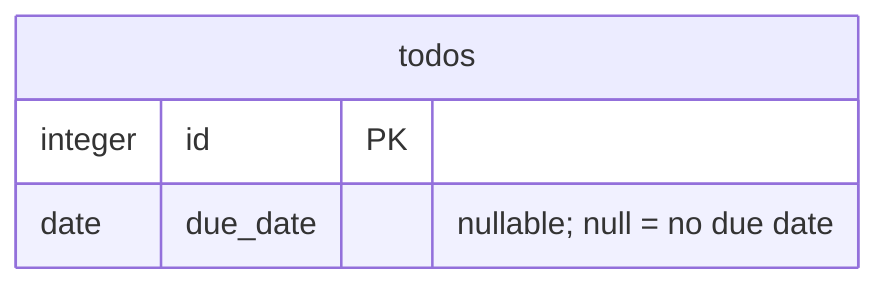

# Data model (system layer · view 4 of 4)

You model the data of **one bounded context**. This layer is global and single-source-of-truth; you read
the whole relevant data model and add to it. Cadence is coarser than a spec on purpose — the data model is
owned across specs, so two specs that touch the same concept must not model it twice. You run after the
domain view (in parallel with architecture).

## What you write

| File (under `_system/<ctx>/`) | Element id | Holds |
| --- | --- | --- |
| `data-model.md` | `DATA-<CTX>-NNN` | logical model (DBML SSOT) → schema, ownership, keys, migration, derived ER diagram |

**Data follows the domain.** Read `domain-model.md` first; your tables/columns realise the domain entities
(`DOM-<CTX>-NNN`), they do not invent new concepts. If you find yourself naming a new concept, that belongs
in the **domain perspective** ([references/domain.md](domain.md)).

## Structured SSOT + derived skin (the key discipline)

The **DBML block is the structured SSOT**; the Mermaid `erDiagram` and any SQL DDL are *derived* from it
(DOC_TAXONOMY §データビューの実体化). Author the DBML, regenerate the diagram — never hand-edit the diagram
to diverge. DBML carries table/column/type/PK·FK/enum/index and makes relations first-class, is plain text
that diffs in a PR, and converts to SQL via `@dbml/cli`; Mermaid renders natively in GitHub/VS Code so the
ER view is a zero-infra always-on projection.

Tag each `DATA-<CTX>-NNN` element where it lives — a DBML comment or column `note:` — so the id stays
referenceable (`dependsOnSystem` and `check-*` find it by text). Judgement (invariants, the reason for a
migration) stays prose; the schema and diagram are structured/derived.

## Lazy boundary / coherent within

- **Coherent** — model the touched aggregate's data coherently (ownership, keys, relations) so a later
  spec cannot add the same entity under a different table/name.
- **Lazy** — materialise only the physical columns the current acceptance criteria need. Defer the rest;
  add them additively when an AC requires them.
- **Falsifiable test** for a column/table: *"If I omit this, can a future spec re-introduce the same data
  under a different name?"* Yes → model now. No → defer.

## Additive only / migration

- `DATA-<CTX>-NNN` ids are unique and stable within the context. Never renumber or rewrite an existing
  id's meaning.
- A change is a **new** element + a migration, with a back-compat note (e.g., existing rows read as null).

## Worked example (Todo-due, "scheduling" context, first touch)

```dbml
// DATA-scheduling-014 — todos.dueDate: persisted due-date value; realises DOM-scheduling-001. owner: todo module.
Table todos {
  id integer [pk]
  due_date date [null, note: 'DATA-scheduling-014 — ISO-8601; null = no due date (first-class), never a sentinel']
}
```

Derived ER view (regenerated from the DBML, not hand-authored):



Only the one column the AC needs is materialised; overdue stays derived (no column); the rest of any
scheduling schema is deferred (lazy). Migration is additive — existing rows read as `null`, no backfill.

## Reverse mode (distilling from code)

When the source is existing code, reverse the DBML from the **real** persistence — the live schema,
migrations, or ORM models — then derive the ER diagram. This is the most faithful view; the database does
not lie. Tag each element with `file:symbol` evidence; the output is a **draft proposal** for human review,
not a direct write. See [reverse.md](reverse.md).

## Output / signal

Produce the data-model delta (DBML SSOT + derived diagram + migration prose) and record `reads` / `extends`
(with affected AC-IDs in spec mode) in the run's `design-delta.md`. `check-system-design` verifies the
delta's referenced ids are present in the system layer. Signal completion; do not change workflow state or
sign.
