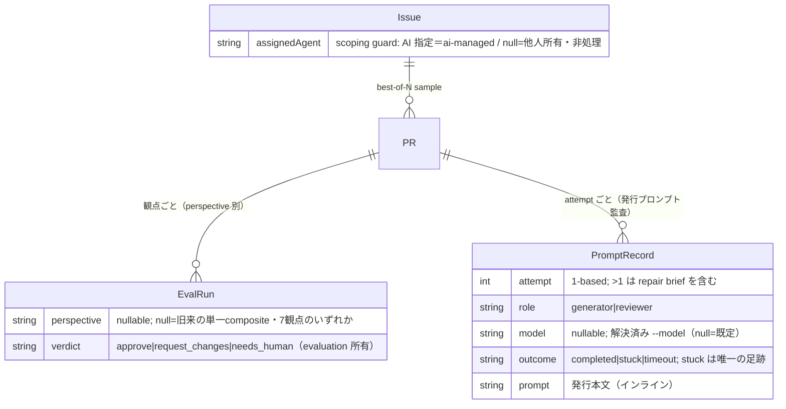

# データモデル — execution コンテキスト

> 構造化 SSOT は**実際の永続実体に合わせる**（DOC_TAXONOMY §データビューの実体化）。このハーネスの永続は
> **JSON ストア（`.harness/db.json`）**で、その形は既に
> **Zod schema（`apps/agentops/src/domain/schema.ts`）が単一正本**。
> よって本ファイルは schema を**参照**するだけで、DBML へ書き写さない（二重 SSOT は drift する）。
> エンティティは [domain-model.md](domain-model.md)（`DOM-execution-NNN`）を実体化する。追加のみ。
>
> **execution はほぼ永続実体を持たない**——Session/Worktree/Sentinel は揮発（`DOM-execution-002`）で、真実は
> 既存の Issue/PR/EvalRun に写る。Scoping Guard は既存 `Issue.assignedAgent` を*再利用*するだけで新フィールドを
> 足さない（下記 §契約）。新規の永続実体は2点のみ: パネル（`DOM-execution-003`）が生む**観点タグ**（`DATA-execution-001`）と、
> 揮発する発行プロンプトの**監査射影**（`DATA-execution-006`）。後者は Session の実行時揮発性を変えない——PROMPT.md は
> 従来どおり上書き・wipe され、store には監査用のコピーだけが durable に写る。

## 論理モデル（構造化 SSOT＝コードスキーマ参照）

正本は `apps/agentops/src/domain/schema.ts` の Zod 型。下記は id 付けと意味の付与のみ
（フィールドは正本を参照、再掲しない）。

- **DATA-execution-001 `EvalRun.perspective`** — パネルの各観点採点がどの lens かを識別するタグ; 実体化 DOM-execution-003/004。
  source: `apps/agentops/src/domain/schema.ts` → `EvalRun`（Zod・additive に `perspective?` を追加）。owner: execution の panel が書き、evaluation の grader が各観点を採点。
  形: `perspective: string | null`（`LANG-execution-010` の7観点のいずれか。`null` = 旧来の単一 composite 採点＝一級の意味、sentinel でない）。同一 PR に観点数だけの EvalRun がぶら下がり、sample の最終 Verdict はそれらの集約（`DOM-execution-004`）として**派生**する（集約値は保存しない）。
- **DATA-execution-005 `PR.externalRef`** — 審査ゲートの GitHub PR 投影への逆参照（[ADR-0006](../../decisions/ADR-0006-evaluator-panel-sessions-and-github-pr-gate.md) G1・`ARCH-execution-008`）。
  source: `apps/agentops/src/domain/schema.ts` → `PR`（Zod・additive に `externalRef?` を追加。実体は `PrExternalRef = { provider: 'github', number, url }`）。owner: `openGate` が投影時に書き、`pollGate` が PR 状態のポーリング先として読む（`apps/agentops/src/pipeline/execution/gate.ts`）。
  形: `externalRef: PrExternalRef | null`（`null` = 未投影＝store 直ゲート／ローカル sandbox）。**store が SoT**（`ARCH-execution-009`・ADR-0001）——これは真実でなく投影への back-ref。PR の merged/closed は人間判定の入力元にすぎず、確定は `recordHumanDecision`（`released`／repair）＋`EvalRun.humanVerdict`（G3 較正）に写る。
- **DATA-execution-006 `PromptRecord`** — 役割セッションに発行した**プロンプト本文の監査射影**; 実体化 `DOM-execution-002`（Session が所有する scoped-context/プロンプト・`LANG-execution-007`）。Session の PROMPT.md は repair attempt ごとに**同一パスへ上書き**され `.harness/` ごと wipe される揮発物なので、attempt 1 の本文と「repair brief が attempt 2 をどう変えたか」が失われる。それを store（唯一の inspectable SoT）へ durable にコピーする。
  source: `apps/agentops/src/domain/schema.ts` → `PromptRecord`（Zod・新規 collection `DB.promptRecords`）。owner: オーケストレータ（`apps/agentops/src/pipeline/execution/live.ts` の `runLiveSample`）が generator セッション完了直後に1件追記。**seam の上で書く**（`DOM-execution-008`）——セッション層は store を触らず、発行本文を返すだけ。
  形: 1 行 = `(issueId, prId, sampleIndex, attempt, role)`。`role: 'generator' | 'reviewer'`（現状 generator のみ発行・reviewer は将来の additive 拡張）、`perspective: string | null`（reviewer の lens・generator は `null`）、`model: string | null`（解決済み `--model`・`null`=ユーザ既定＝`config.models` の射影）、`outcome: string | null`（`completed`/`stuck`/`timeout`——**stuck attempt は EvalRun を生まない**ので、この record が唯一の durable な足跡になる・`DOM-execution-009` の監査版）、`prompt: string`（本文をインラインで保持——`.harness/db.json` は gitignore・ローカル揮発なので肥大は git を汚さない）。

## エンティティ関係（Mermaid — 上記スキーマから派生）

## 永続契約と migration

- **DATA-execution-002** — `EvalRun.perspective` は **additive な optional フィールド**: 既存の EvalRun は不在（`null`）として読まれ、旧来の単一 composite 採点として扱う。backfill 無し。この1点を知らない reader は影響を受けない。
- **DATA-execution-003 スコープガードは新規状態を持たない** — opt-in 指定（`LANG-execution-012`・`DOM-execution-006`）は既存 `Issue.assignedAgent`（`schema.ts`）を*再利用*する: 担当 AI が入っていれば ai-managed、`null` なら他人所有・非処理。新フィールドは足さない。`ai-managed` ラベルは `assignedAgent` の人間可視な射影であって別実体ではない。所有者（「私」vs「他人」）の厳密な区別が要る段階で `owner`/`createdBy` を additive に足す（現状は単一 store のため forward-ref）。
- **DATA-execution-004 Session/Worktree/Sentinel は非永続** — 揮発（`DOM-execution-002`・`ARCH-execution-009`）。resume は store（PR/Issue status）から在庫を再構成する。worktree パス・branch は既存 `PR.branch` に写り、新しい永続実体を作らない。
- **DATA-execution-007 `PromptRecord` は additive な監査射影** — 新規 collection `DB.promptRecords` は `default([])`: 既存 DB は空で読まれ、この collection を知らない reader は無影響。backfill 無し。**揮発性の例外ではない**——Session は依然として非永続（`DATA-execution-004`）で、これは実行時状態でなく発行本文の監査コピー。プロンプトはインライン保持だが `.harness/` は gitignore・ローカル揮発なので共有・git を汚さない。将来 reviewer プロンプトや evidence-file 参照へ移す場合も `role`/`perspective`/インライン `prompt` は additive に据え置ける。
- **DATA-execution-008 Reviewer Workspace / Review Evidence Sidecar は非永続** — `LANG-execution-015`/`016` は `.harness/review-worktrees` と `.harness/review-evidence` に置く揮発実体で、DB collectionを追加しない。採用された findings は従来どおり `EvalRun.findings` へ写り、source change violation は `touchedCode`、許容された環境副作用は `environmentChanges` として1回の `PerspectiveSessionsResult` に帰属する。completed workspace は結果収集後に破棄し、stuck/timeoutだけ既存 liveness 方針に従って調査用に残す。
- **DATA-execution-009 `BuildArtifact.verificationEvidence`** — AC-IDをkeyに`{method, command|null, passed, output}`を持つadditive optional record。grounded live artifactでは全ACに1件、legacy/mock artifactでは不在を許す。outputは末尾8KBへ境界化し、artifact evidence JSONとscorecard traceに残す。`command:null`はintrinsic checkまたは未設定を表し、outputが両者を区別する。EvalTaskは従来どおり`graderCommands[method]`へ観測時commandをcaptureする。
- **DATA-execution-010 `PRRevision`** — durable row `{id, prId, headSha, ordinal, status, mergeRequestedAt, createdAt, completedAt}`。statusは`pending|reviewing|changes-requested|approved|merged|stale|failed`。`(prId, headSha)`一意で、再poll/再配送は同じrowを再利用する。`mergeRequestedAt`はmerge queue投入済みの再要求を防ぐ。EvalRunとAgentInvocationはadditiveな`revisionId/headSha`で同じrevisionへ帰属する（ADR-0009）。
- **DATA-execution-011 `RevisionGateSnapshot`** — current revisionの必須Perspective verdict、deterministic gates、GitHub check state、unresolved blocking threadのid/body/path/line、mergeabilityを1回の判定証拠として保持する。JSON rowは監査証拠であり、それ自体はmerge権限ではない。外部merge要求はfresh評価が発行する非永続symbol capabilityだけが許可し、process再開後の完了照合はapproved rowに加えて同headのdurable `mergeRequestedAt`を必須とする。`IntakeRecord.sourceClosedAt/sourceCloseError`は分割Source Issue集約closeの成功または再試行待ちを表す。
- **DATA-execution-012 `PR.origin` / `PR.agentGeneratedHeadSha`** — `origin`は`issue-pipeline|repository-discovery`のadditive discriminator、`agentGeneratedHeadSha`はtrusted Generatorがpush成功後に記録するnullableなfull SHA。既存rowはそれぞれ`issue-pipeline`/`null`でfail-closedに読む。repository pollが外部PR番号をdedup keyとして作ったrowだけ`repository-discovery`を持ち、そのsynthetic Issueは`assignedAgent=null`を保持する。originに関係なくGitHub current headが`agentGeneratedHeadSha`と一致しないprojected PRは権限付きrepair queueへ入れない。
- **DATA-execution-013 `ExternalWorkIdentity` PR projection** — DB collectionは追加せず、Source Issueの`IntakeRecord.snapshot.repository/number`・`intakeKey`・Issueの`planningCandidateKey`・control release ID・sample indexから毎回決定的に導く。PR bodyの`agentops-work-identity-v1` markerは正規化JSONのbase64url投影で、qualified closing/reference targetと両方が一致するときだけ再利用できる。Store-local `Issue.id`は表示・内部関連用に留め、この外部mutation identityには入れない。
