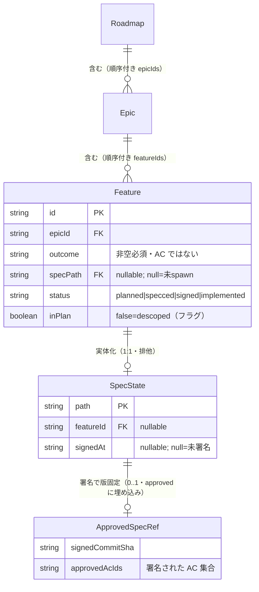

# データモデル — planning コンテキスト

> 構造化 SSOT は**実際の永続実体に合わせる**（DOC_TAXONOMY §データビューの実体化）。このハーネスの永続は
> **JSON ストア（`.harness/db.json`）**で、その形は既に
> **Zod schema（`apps/agentops/src/domain/schema.ts`）が単一正本**。
> よって本ファイルは schema を**参照**するだけで、テーブル（DBML）へ書き写さない（二重 SSOT は drift する）。
> ここに足すのは `DATA-planning-NNN` の id・所有・不変条件・migration の判断のみ。図は schema から派生。
> エンティティは [domain-model.md](domain-model.md)（`DOM-planning-NNN`）を実体化する。追加のみ。

## 論理モデル（構造化 SSOT＝コードスキーマ参照）

正本は `apps/agentops/src/domain/schema.ts` の Zod 型。下記は id 付けと意味の付与のみ
（フィールドは正本を参照、再掲しない）。

- **DATA-planning-001 `Roadmap`** — 計画の木の根（store につき単一）; 実体化 DOM-planning-001。
  source: `apps/agentops/src/domain/schema.ts` → `Roadmap`（Zod）。owner: store。形: `vision` / `principles[]` / 順序付き `epicIds[]`。
- **DATA-planning-002 `Epic`** — feature の粗いまとまり; 実体化 DOM-planning-002。
  source: `schema.ts` → `Epic`。owner: store。形: `id`（`EPIC-NN`）/ `title` / `theme` / `status` / 順序付き `featureIds[]`。
- **DATA-planning-003 `Feature`** — 計画の木の葉＝署名可能な能力; 実体化 DOM-planning-003。
  source: `schema.ts` → `Feature`。owner: store。形: `id`（`FEAT-NNN`）/ `title` / `status`（`planned|specced|signed|implemented`）/ `createdAt` / `updatedAt`。
- **DATA-planning-004 `Feature.outcome`** — 価値・「なぜ今」; 実体化 DOM-planning-004。
  source: `schema.ts` → `Feature.outcome`。形: `string`（**非空必須**・AC は決して入れない）。
- **DATA-planning-005 `Feature.specPath`** — 実体化した spec の参照; 実体化 DOM-planning-007。
  source: `schema.ts` → `Feature.specPath`。形: `string | null`（`null` = 未 spawn・一級の意味、sentinel でない）。`SpecState.featureId` と双方向。
- **DATA-planning-006 `Feature.inPlan`** — 計画在否フラグ; 実体化 DOM-planning-010。
  source: `schema.ts` → `Feature.inPlan`。形: `boolean`（`false` = descoped：フラグであって削除でない）。
- **DATA-planning-007 `SpecState`** — spec の署名ライフサイクル記録; 実体化 DOM-planning-004。
  source: `schema.ts` → `SpecState`。owner: store。**同一性は `path`（spec dir）**。形: `path` / `featureId: string | null`（`Feature.specPath` と双方向）/ `signedAt: string | null` / timestamps。
- **DATA-planning-008 `SpecState.approved`（`ApprovedSpecRef`）** — 1 回の人間承認の版固定（埋め込み値オブジェクト）; 実体化 DOM-planning-005。
  source: `schema.ts` → `ApprovedSpecRef`。形: `signedCommitSha` / `specBlobGitSha` / `acceptanceBlobGitSha` / `acFingerprints`（AC-ID→fingerprint）/ `systemRefs[]` / `approvedAcIds[]`。`null` until 初回署名。`status` は `approvedAcIds` と現在 AC 集合から**派生**し、保存しない。

## エンティティ関係（Mermaid — 上記スキーマから派生）

## 永続契約と migration

- **DATA-planning-009** — greenfield 導入は **additive**: 新しいコレクション（`roadmap`/`epics`/`features`/`specStates`）は、JSON ストアで不在なら空として読まれる。backfill 無し。
- **DATA-planning-010** — `Feature.specPath` と `SpecState.approved` は nullable で **null が一級の意味**（未 spawn／未署名）であり sentinel でない。後から additive に増えたフィールドを知らない reader は影響を受けない。
- **DATA-planning-011** — 署名済みレコード（`SpecState.approved != null`）は**再取込下で不変**: 再取込は書き換えない; 再署名は `approved` 値オブジェクトを丸ごと置換する（`DOM-planning-009`）。descope は `Feature.inPlan` だけを変え、レコードを削除しない（`DOM-planning-010`）。
