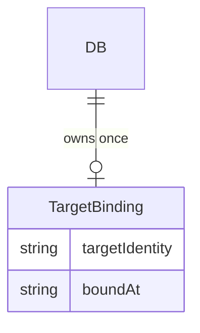

# データモデル — workspace コンテキスト

> 永続はJSON storeであり、構造化SSOTは`src/domain/schema.ts`のZod schema。本書は構造を複製せず、
> workspace要素の所有・意味・migrationだけを定める。

## 論理モデル（コードスキーマ参照）

- **DATA-workspace-001 `DB.targetBinding`** — `DOM-workspace-003`の耐久表現。
  source: `src/domain/schema.ts` → `DB` / `TargetBinding` (Zod)。owner: workspace。
  `null`は未束縛を表し、空storeかLegacy Unbound Storeかは既存組織状態の有無から決定する。

## 関係（schemaからの派生）

## 永続契約とmigration

- **DATA-workspace-002 additive migration** — `targetBinding`はnullable/default nullとして追加し、既存DBを
  読める。空の既存DBは最初のmutationで自動束縛できる。状態を持つ既存DBはLegacy Unbound Storeとして
  fail-closedし、明示移行なしに現在configを正しいtargetと推測しない。
- **DATA-workspace-003 immutable binding** — bindingのidentityは通常commandから更新されない。`boundAt`は
  初回束縛の監査時刻であり、同一targetの再実行で更新しない。
- **DATA-workspace-004 `HarnessConfig.target.repo`** — Authoring Target Rootとexecution targetを指すpath入力。
  DBへ複製せず、耐久照合は`DB.targetBinding.targetIdentity`、spec lifecycleはOrganization StoreのSpecState、
  WHAT文書とgit blobはtarget repositoryが所有する。
