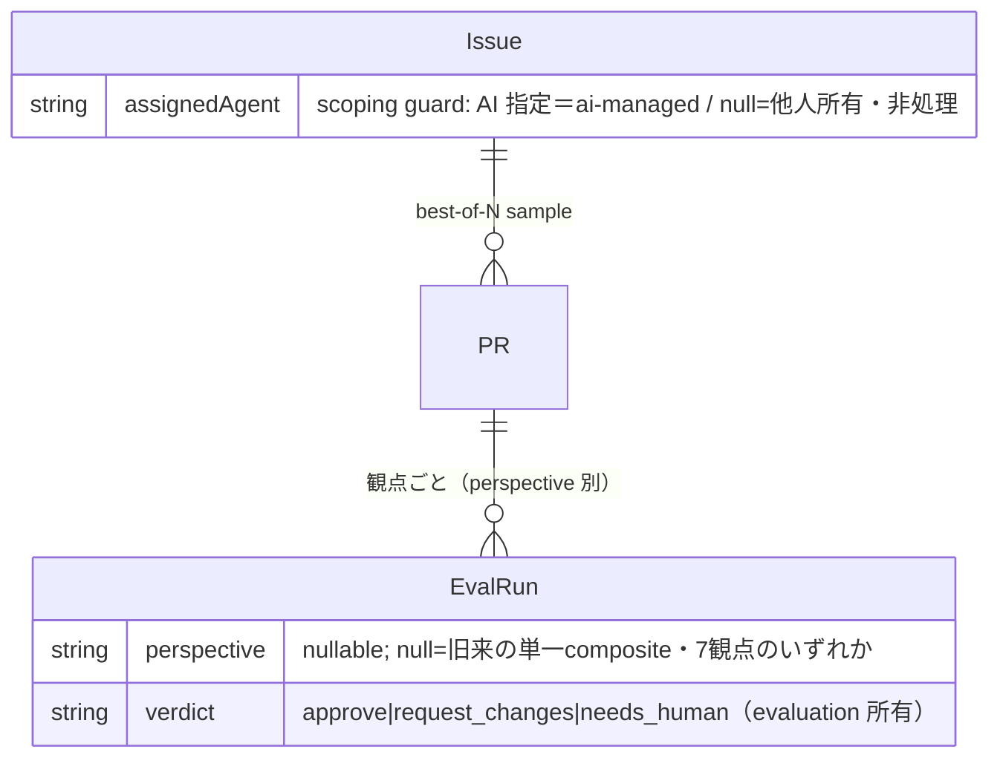

# データモデル — execution コンテキスト

> 構造化 SSOT は**実際の永続実体に合わせる**（DOC_TAXONOMY §データビューの実体化）。このハーネスの永続は
> **JSON ストア（`.harness/db.json`）**で、その形は既に **Zod schema（`src/domain/schema.ts`）が単一正本**。
> よって本ファイルは schema を**参照**するだけで、DBML へ書き写さない（二重 SSOT は drift する）。
> エンティティは [domain-model.md](domain-model.md)（`DOM-execution-NNN`）を実体化する。追加のみ。
>
> **execution はほぼ永続実体を持たない**——Session/Worktree/Sentinel は揮発（`DOM-execution-002`）で、真実は
> 既存の Issue/PR/EvalRun に写る。Scoping Guard は既存 `Issue.assignedAgent` を*再利用*するだけで新フィールドを
> 足さない（下記 §契約）。新規の永続状態は、パネル（`DOM-execution-003`）が生む**観点タグ**の1点のみ。

## 論理モデル（構造化 SSOT＝コードスキーマ参照）

正本は `src/domain/schema.ts` の Zod 型。下記は id 付けと意味の付与のみ（フィールドは正本を参照、再掲しない）。

- **DATA-execution-001 `EvalRun.perspective`** — パネルの各観点採点がどの lens かを識別するタグ; 実体化 DOM-execution-003/004。
  source: `src/domain/schema.ts` → `EvalRun`（Zod・additive に `perspective?` を追加）。owner: execution の panel が書き、evaluation の grader が各観点を採点。
  形: `perspective: string | null`（`LANG-execution-010` の7観点のいずれか。`null` = 旧来の単一 composite 採点＝一級の意味、sentinel でない）。同一 PR に観点数だけの EvalRun がぶら下がり、sample の最終 Verdict はそれらの集約（`DOM-execution-004`）として**派生**する（集約値は保存しない）。
- **DATA-execution-005 `PR.externalRef`** — 審査ゲートの GitHub PR 投影への逆参照（[ADR-0006](../../../decisions/ADR-0006-evaluator-panel-sessions-and-github-pr-gate.md) G1・`ARCH-execution-008`）。
  source: `src/domain/schema.ts` → `PR`（Zod・additive に `externalRef?` を追加。実体は `PrExternalRef = { provider: 'github', number, url }`）。owner: `openGate` が投影時に書き、`pollGate` が PR 状態のポーリング先として読む（`src/pipeline/execution/gate.ts`）。
  形: `externalRef: PrExternalRef | null`（`null` = 未投影＝store 直ゲート／ローカル sandbox）。**store が SoT**（`ARCH-execution-009`・ADR-0001）——これは真実でなく投影への back-ref。PR の merged/closed は人間判定の入力元にすぎず、確定は `recordHumanDecision`（`released`／repair）＋`EvalRun.humanVerdict`（G3 較正）に写る。

## エンティティ関係（Mermaid — 上記スキーマから派生）

## 永続契約と migration

- **DATA-execution-002** — `EvalRun.perspective` は **additive な optional フィールド**: 既存の EvalRun は不在（`null`）として読まれ、旧来の単一 composite 採点として扱う。backfill 無し。この1点を知らない reader は影響を受けない。
- **DATA-execution-003 スコープガードは新規状態を持たない** — opt-in 指定（`LANG-execution-012`・`DOM-execution-006`）は既存 `Issue.assignedAgent`（`schema.ts`）を*再利用*する: 担当 AI が入っていれば ai-managed、`null` なら他人所有・非処理。新フィールドは足さない。`ai-managed` ラベルは `assignedAgent` の人間可視な射影であって別実体ではない。所有者（「私」vs「他人」）の厳密な区別が要る段階で `owner`/`createdBy` を additive に足す（現状は単一 store のため forward-ref）。
- **DATA-execution-004 Session/Worktree/Sentinel は非永続** — 揮発（`DOM-execution-002`・`ARCH-execution-009`）。resume は store（PR/Issue status）から在庫を再構成する。worktree パス・branch は既存 `PR.branch` に写り、新しい永続実体を作らない。
